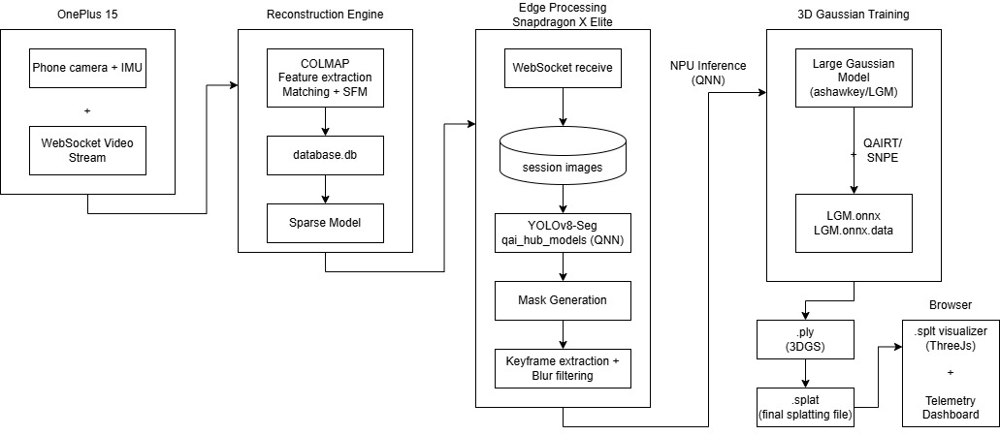

# SplatMesh-Core: Unified Capture & Reconstruction Pipeline

This repository contains the real-time video streaming, dynamic edge-culling, and automated 3D reconstruction system for the SplatMesh pipeline. It consists of a mobile web client and a high-performance Python orchestrator that handles ingestion, blur filtering, and GPU-accelerated Structure-from-Motion (SfM) via COLMAP.

---

## Architecture Overview



The system is designed to handle network backpressure and avoid buffer bloat using a decoupled two-phase pipeline:

```text
[Mobile Phone Client] 
   - Captures Video + IMU Telemetry
   - Client-side Throttling (~8 FPS) & Network Circuit Breaker (ws.bufferedAmount)
   - Streams packaged binary (32-byte header + JPEG) over WebSockets
         │
         ▼
[Python Orchestrator Server (Port 3000)]
   - Phase 1 (I/O Bound): High-speed disk buffering with TCP backpressure management
   - Safely recovers sessions on abrupt network disconnects
         │
         ▼ (Triggered upon clean stop or network drop)
[Batch Processor & Reconstruction]
   - Intelligent Culling: Computes Laplacian variance to drop blurry frames
   - GPU Pipeline: Triggers CUDA-accelerated SIFT extraction and mapping
   - Exporter: Automatically converts sparse binaries to `model.ply`

```

---

## Setup and Installation

### 1. Prerequisites

Ensure COLMAP is installed on your desktop/laptop. The wrapper will automatically search your system path, with a fallback to `C:\colmap\COLMAP.bat`.

Create a `requirements.txt` file in your root directory (see contents below) and install the dependencies:

```bash
pip install -r requirements.txt

```

### 2. Directory Structure

Ensure your project is structured flatly to allow the server to locate the mobile client and the COLMAP wrapper:

```text
SplatMesh-Core/video-capture/capture/desktop
├── server.py
├── colmap_wrapper.py
├── requirements.txt
└── mobile/
    └── phone_stream.html

```

### 3. Mobile Browser Configuration

Mobile browsers block camera and sensor APIs on insecure local IPs by default. To bypass this for local development:

1. Open Chrome on your mobile device.
2. Navigate to `chrome://flags/#unsafely-treat-insecure-origin-as-secure`.
3. Enable the flag and add your laptop's local IP and port (e.g., `[http://10.91.56.127:3000](http://10.91.56.127:3000)`).
4. Tap "Relaunch" to restart Chrome.

---

## Running the Pipeline

### 1. Start the Server

Open a terminal in the root directory and run the orchestrator:

```bash
python server.py

```

The server will initialize on `[http://0.0.0.0:3000](http://0.0.0.0:3000)`.

### 2. Capture Data

1. Navigate to your laptop's IP address on your phone's browser (e.g., `[http://192.168.1.100:3000](http://192.168.1.100:3000)`).
2. Tap **Enable Camera & Sensors**.
3. Tap the **Record** button and slowly orbit the target object for 10–15 seconds.
4. Tap **Stop** (or simply close the browser).

The server will automatically catch the EOF signal, filter the frames, run the GPU reconstruction, and output the final 3D asset.

---

## Directory Output Structure

The server dynamically organizes datasets inside the `data/` folder based on session timestamps:

```text
data/session_<timestamp>/
├── images/
│   ├── frame_<timestamp>_000001.jpg
│   └── ... (Only sharp frames remain after filtering)
├── database.db                   (COLMAP SQLite keypoints/matches)
├── colmap_reconstruction.log     (Detailed COLMAP logging)
└── sparse/
    └── 0/
        ├── cameras.bin           
        ├── images.bin            
        ├── points3D.bin          
        └── model.ply             <-- FINAL 3D ASSET (Import to Blender/Splat Engine)

```

---

## Troubleshooting

* **Address Already in Use (Errno 10048)**: A previous server instance did not close cleanly. Run this in PowerShell to release the port:
```powershell
Stop-Process -Id (Get-NetTCPConnection -LocalPort 3000 -State Listen).OwningProcess -Force -ErrorAction SilentlyContinue

```


* **"Not enough sharp frames left to run COLMAP"**: If you are scanning a smooth or featureless object (like a plain mouse), the Laplacian variance filter might aggressively delete good frames. Open `server.py` and lower the `BLUR_THRESHOLD` (set to `0.0` to disable filtering entirely).
* **Network Disconnects Instantly**: Ensure you are using the updated `phone_stream.html` with the `ws.bufferedAmount` circuit breaker, which prevents mobile TCP queues from overflowing.

---
